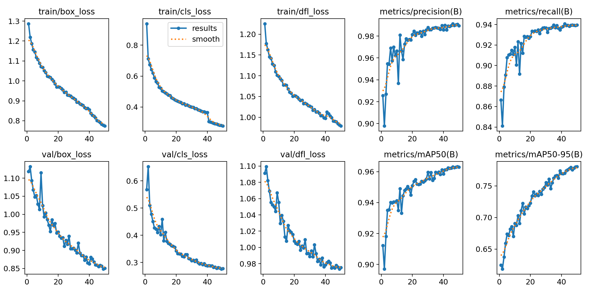

<p align="center">
  
</p>

# Bliscan

Bliscan is a full-stack computer vision system for detecting pills and empty cells in pharmaceutical blister packs using a custom YOLOv8 model.

---

## Model Performance (Validation)

Metrics below correspond to the final epoch (50) of the training run stored in `backend/model/bliscan-yolov8m6/`.

| Metric | Value |
|--------|-------|
| mAP@0.5 | 96.29% |
| mAP@0.5:0.95 | 78.06% |
| Precision | 98.95% |
| Recall | 93.95% |

Training reference: YOLOv8s, image size 640, batch 16, up to 50 epochs, early stopping patience 15, mixed precision (AMP). Hardware: NVIDIA RTX 4060.



---

## What this repository contains

- **Live inspection backend:** `backend/cameraScript2.py` (Flask, MJPEG stream, webcam inference, live counts on port 5002).
- **REST inference API:** `backend/api.py` (FastAPI endpoint for uploaded images with class counts and annotated base64 output).
- **Web frontend:** `frontend/vite-project` (React + Vite operator UI for camera monitoring).

---

## Tech Stack

| Layer | Technologies |
|-------|--------------|
| Model | PyTorch, Ultralytics YOLOv8, OpenCV |
| Live backend | Flask, Flask-CORS, threading |
| API | FastAPI, Uvicorn, python-multipart |
| Frontend | React, TypeScript, Vite, Material UI |

---

## Prerequisites

- Python 3.10+ (project currently runs with Python 3.13 in this repository).
- Node.js 18+.
- Webcam access for the live demo.
- Model weights at `backend/model/modelin.pt`.

Note: PyTorch 2.6+ defaults to safer deserialization (`weights_only=True`). This project patches trusted YOLO checkpoint loading in backend services to remain compatible.

---

## Run the Project

### 1) Backend (Flask live server)

```bash
cd backend
python -m venv venv
source venv/bin/activate   # Windows: venv\Scripts\activate
pip install -r requirements.txt
python cameraScript2.py
```

This starts the live backend at `http://localhost:5002`.

### 2) Frontend (React + Vite)

```bash
cd frontend/vite-project
npm install
npm run dev
```

Open the URL shown by Vite (typically `http://localhost:5173`).

### Optional: FastAPI backend

```bash
cd backend
source venv/bin/activate
uvicorn api:app --reload --host 0.0.0.0 --port 8000
```

---

## Training and Evaluation (YOLO CLI)

Example training command:

```bash
yolo task=detect mode=train model=yolov8s.pt data=path/to/data.yaml epochs=50 imgsz=640 batch=16 patience=15
```

Example validation command:

```bash
yolo task=detect mode=val model=path/to/best.pt data=path/to/data.yaml
```

---

## Project Structure

```text
Bliscan/
├── backend/
│   ├── api.py
│   ├── cameraScript2.py
│   ├── requirements.txt
│   ├── model/
│   │   ├── modelin.pt
│   │   └── bliscan-yolov8m6/
│   └── test/
├── frontend/
│   └── vite-project/
└── README.md
```
