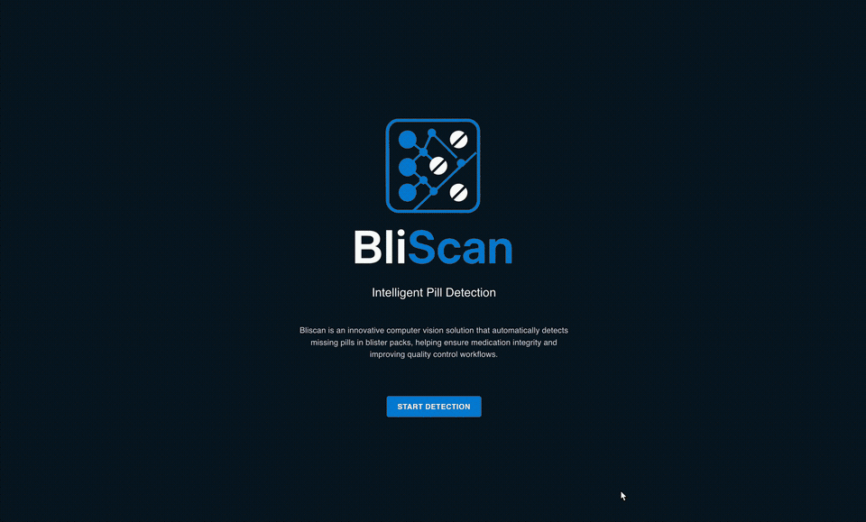
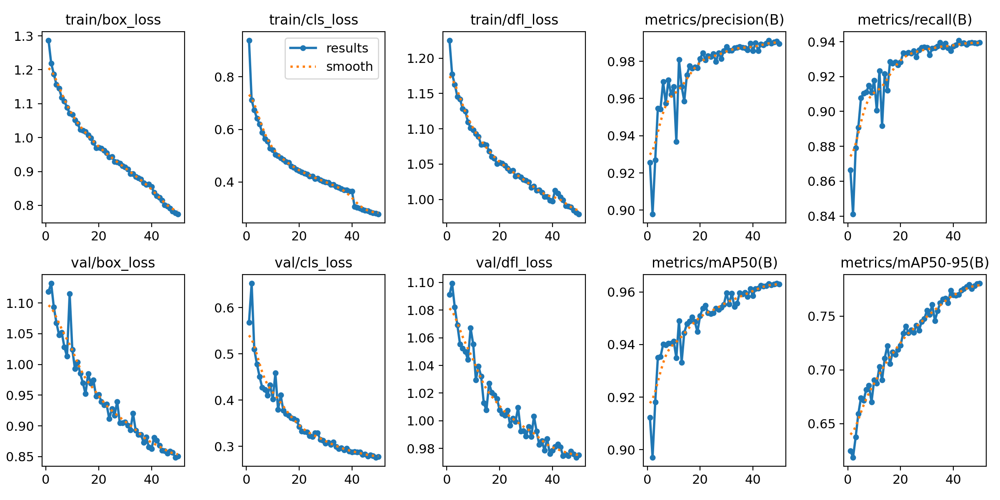

<p align="center">
  
</p>

# BliScan

**1st Place — Expo Ingeniería x Innovation Challenge 2025, CETYS Universidad**  
[Award post (certificate & trophy)](https://www.linkedin.com/feed/update/urn:li:activity:7331820149240406018/)

Real-time computer vision system for pharmaceutical blister-pack quality control. BliScan detects **Full** (filled) and **Empty** (missing pill) cells using a custom **YOLOv8s** detector, a Flask live-streaming backend, and a React operator dashboard.

---

## Model Performance (Validation)

Metrics below are taken from **epoch 50** of the training run in `backend/model/bliscan-yolov8m6/results.csv` (Ultralytics validation split). They are not estimates.

| Metric | Value |
|--------|-------|
| mAP@0.5 | **96.29%** |
| mAP@0.5:0.95 | **78.06%** |
| Precision | **98.95%** |
| Recall | **93.95%** |

**Training configuration (from project artifacts):**

| Setting | Value |
|---------|-------|
| Base model | **YOLOv8s** (`yolov8s.pt`) |
| Image size | 640 |
| Batch size | 16 |
| Epochs | 50 |
| Early stopping patience | 15 |
| Mixed precision (AMP) | Enabled |
| Training hardware | NVIDIA RTX 4060 |
| Served weights | `backend/model/modelin.pt` |



---

## What this repository contains

- **Live inspection backend:** `backend/cameraScript2.py` — Flask MJPEG stream, webcam inference, and live class counts on port **5002**.
- **REST inference API:** `backend/api.py` — FastAPI `POST /detect` for image upload; returns per-class counts and a base64-annotated frame.
- **Web frontend:** `frontend/vite-project` — React + Vite UI for the camera monitoring workflow.

---

## Tech Stack

| Layer | Technologies |
|-------|--------------|
| Model | PyTorch, Ultralytics **YOLOv8s**, OpenCV |
| Live backend | Flask, Flask-CORS, threading |
| API | FastAPI, Uvicorn, python-multipart |
| Frontend | React, TypeScript, Vite, Material UI |

---

## Prerequisites

- Python 3.10+ (tested with Python 3.13 in this repo).
- Node.js 18+.
- Webcam access for the live demo.
- Model weights at `backend/model/modelin.pt`.

**Note:** PyTorch 2.6+ defaults to `weights_only=True` on `torch.load`. Backend services patch trusted YOLO checkpoint loading for compatibility (`api.py`, `cameraScript2.py`).

---

## Run the Project

### 1) Backend (Flask live server)

```bash
cd backend
python -m venv venv
source venv/bin/activate   # Windows: venv\Scripts\activate
pip install -r requirements.txt
python cameraScript2.py
```

Live backend: `http://localhost:5002`

Optional tuning via environment variables (see `.env.example`):

```bash
BLISCAN_STREAM_FPS=30 BLISCAN_CAMERA_WIDTH=1280 BLISCAN_CAMERA_HEIGHT=720 BLISCAN_JPEG_QUALITY=95 python cameraScript2.py
```

### 2) Frontend (React + Vite)

```bash
cd frontend/vite-project
npm install
npm run dev
```

Open the URL shown by Vite (typically `http://localhost:5173`) → **Start Detection**.

### Optional: FastAPI backend

```bash
cd backend
source venv/bin/activate
uvicorn api:app --reload --host 0.0.0.0 --port 8000
```

---

## Training and Evaluation (YOLO CLI)

Training example (**YOLOv8s**, matching this project):

```bash
yolo task=detect mode=train model=yolov8s.pt data=path/to/data.yaml epochs=50 imgsz=640 batch=16 patience=15 name=bliscan-yolov8m6
```

Validation example (use your local `data.yaml` and checkpoint):

```bash
yolo task=detect mode=val model=backend/model/modelin.pt data=path/to/data.yaml
```

---

## Project Structure

```text
Bliscan/
├── .env.example
├── gif/
│   └── BliscanGIF.gif          # Live demo GIF
├── dataset/
├── backend/
│   ├── api.py                  # FastAPI inference API
│   ├── cameraScript2.py        # Flask live stream + detections
│   ├── requirements.txt
│   ├── model/
│   │   ├── modelin.pt          # Served weights
│   │   └── bliscan-yolov8m6/   # Training logs, curves, results.csv
│   └── test/
├── frontend/
│   └── vite-project/           # React UI
└── README.md
```
